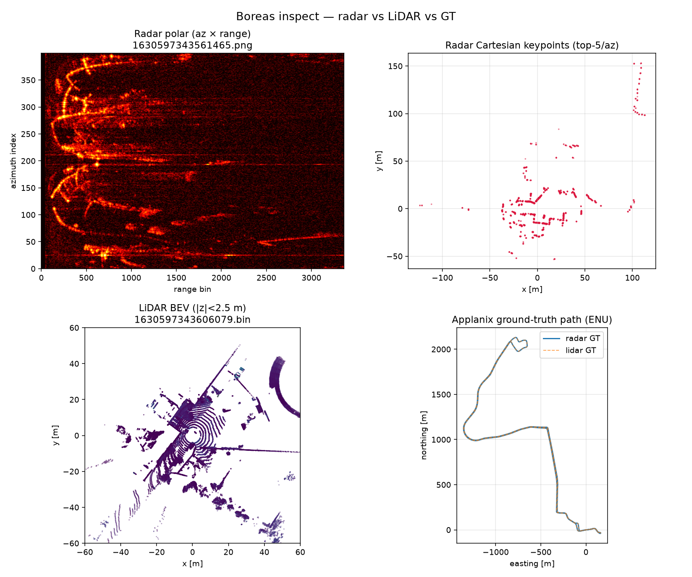
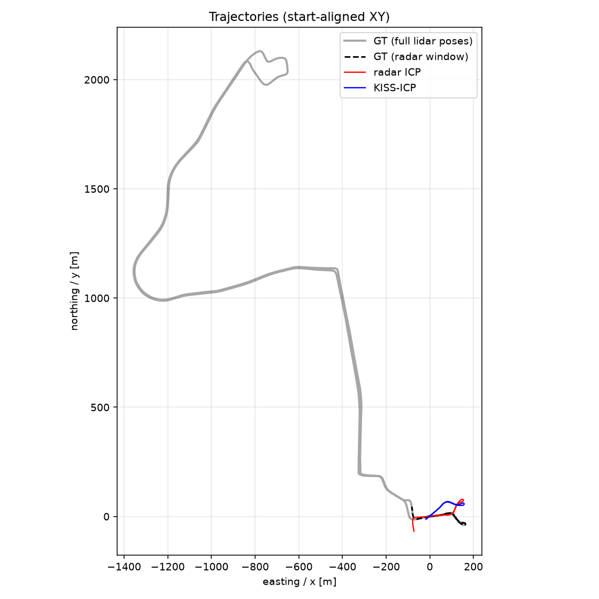
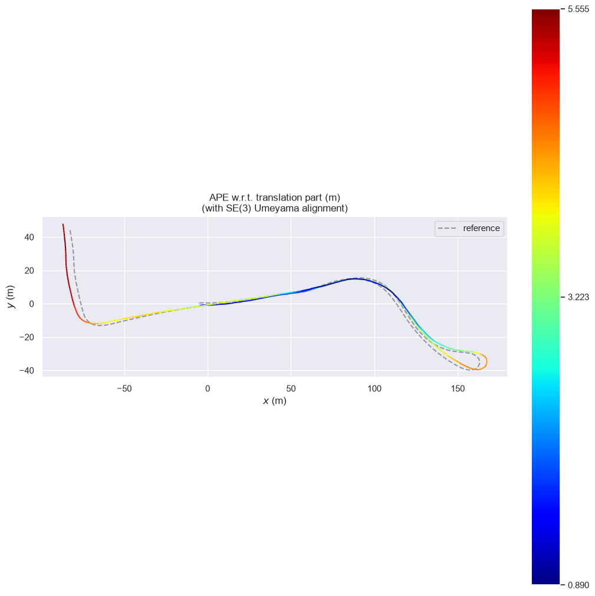
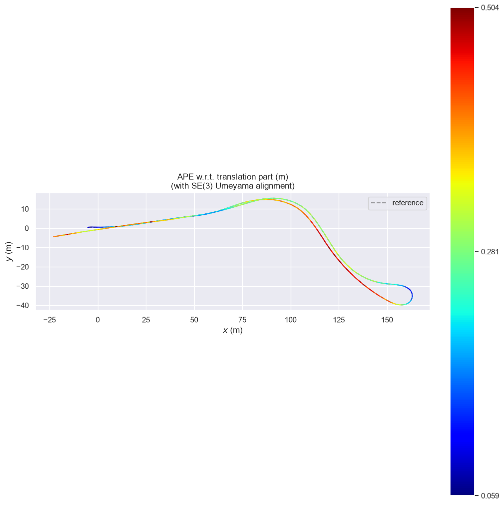

# Outdoor Radar & LiDAR Odometry under Adverse Weather

**Learn-by-doing mini-project** on the [Boreas](https://www.boreas.utias.utoronto.ca/) dataset.

You will:

1. Download one driving sequence (radar + LiDAR + GPS/INS truth)
2. Look at what the sensors see
3. Build **2D radar odometry** (keypoints + ICP)
4. Run a **KISS-ICP LiDAR** baseline
5. Score both with **evo** against Applanix ground truth

Stack: **Python · Open3D · KISS-ICP · evo**

---

## Headline results (already run)

Sequence: `boreas-2021-09-02-11-42`

| Method | RPE drift @ 10 m | ATE RMSE |
|--------|------------------|----------|
| Radar (top-5/az + ICP) | **4.5%** | **3.16 m** |
| LiDAR (KISS-ICP) | **1.3%** | **0.29 m** |

Resume line:

> Built 2D radar odometry (CFAR keypoints + ICP) on Navtech radar from a Boreas sequence and compared it with a KISS-ICP LiDAR baseline against the Applanix GNSS/INS ground truth. Radar drift: **4.5%** vs LiDAR: **1.3%** (evo RPE); ATE **3.16 m** vs **0.29 m**.

---

## Why this project exists (intuition)

| Sensor | Strength | Weakness |
|--------|----------|----------|
| **LiDAR** | Dense, accurate 3D geometry | Snow/fog/spray create false returns and range drop |
| **Radar** | Sees through precipitation | Sparse, noisy, harder to match frame-to-frame |
| **Applanix GNSS/INS** | Centimetre-grade path (truth) | Needs good GNSS; not a “vision” sensor |

**Odometry** = estimate how the vehicle moved using only onboard sensors (no map).  
You chain small relative motions into a trajectory, then compare to GPS/INS truth.

This Sept sequence is not heavy snow — LiDAR still wins. The **same code** is what you re-run on winter Boreas drives (`2020-12-*`, `2021-01-*`) to show radar holding up better.

---

## Repo layout

```
boreas_radar_lidar_odom/
├── README.md                 ← you are here
├── requirements.txt
├── run_all.sh                ← runs steps 2–5
├── sample_data/              ← tiny offline pack (5 frames + preview PNG)
├── scripts/
│   ├── 00_download.sh        ← Step 1: get data from AWS
│   ├── boreas_io.py          ← shared loaders (radar/lidar/poses)
│   ├── 01_inspect.py         ← Step 2: visualize
│   ├── 02_radar_odometry.py  ← Step 3: YOUR method
│   ├── 03_lidar_kiss_icp.py  ← Step 4: baseline
│   └── 04_eval_evo.py        ← Step 5: score with evo
├── out/                      ← full-run plots, trajectories, metrics.json
└── boreas-data/              ← NOT in the zip (download locally; ~8 GB subset)
```

The git/zip package is **code + `sample_data/` + result plots + metrics**. Full `boreas-data/` is downloaded separately (too big for GitHub).

---

## Setup (once)

```bash
cd boreas_radar_lidar_odom
python3 -m venv .venv
source .venv/bin/activate          # Windows: .venv\Scripts\activate
pip install -r requirements.txt
```

Needs: Python 3.10+, AWS CLI (`aws --version`), ~10 GB free disk for a full subset download.

### Offline sample (no AWS needed)

A tiny pack is included: **`sample_data/`** (5 radar + 5 LiDAR frames + poses + calib + preview plot).

```bash
# view without downloading the full sequence
python scripts/01_inspect.py --data sample_data --out out_sample --frame-idx 0
# or open the pre-rendered preview:
# sample_data/preview/inspect_side_by_side.png
```

See `sample_data/README.md`.

---

# Step-by-step (learn each piece)

## Step 1 — Get the data

**Script:** `scripts/00_download.sh`

**What happens**

- Boreas lives on public S3: bucket **`s3://boreas`** (not `boreas-public-dataset`).
- We pull only what we need:
  - `applanix/` — ground-truth poses (CSV)
  - `calib/` — extrinsics between sensors
  - `radar/` — polar PNG scans (~4 Hz)
  - `lidar/` — first N `.bin` clouds (full sequence LiDAR alone is ~30 GB!)

```bash
bash scripts/00_download.sh
# optional: SEQ=boreas-2021-01-26-11-22 MAX_LIDAR=1000 bash scripts/00_download.sh
```

**Learn:** sensor folders, timestamps in filenames (microseconds), why we truncate LiDAR.

**Concept — TUM pose format** (used later):

```text
timestamp_sec  x  y  z  qx  qy  qz  qw
```

Applanix gives easting/northing/altitude + roll/pitch/heading; `boreas_io.py` converts that to TUM.

---

## Step 2 — Load & inspect

**Script:** `scripts/01_inspect.py`  
**Output:** `out/inspect_side_by_side.png`

```bash
python scripts/01_inspect.py --frame-idx 50
```

**What you should notice**

1. **Radar polar image** — rows = azimuth (around the car), columns = range. Bright = strong return (building, curb, truck).
2. **Radar Cartesian keypoints** — same returns as \(x,y\) points in the bird’s-eye plane.
3. **LiDAR BEV** — dense ring of points; walls/trees obvious.
4. **GT path** — the “true” drive path from Applanix.

**Questions to ask yourself**

- Can you find the same building façade in radar keypoints and LiDAR?
- Why is radar sparser? (few strong peaks per direction vs millions of LiDAR points)

**Learn:** polar vs Cartesian; what “a scan” looks like before any odometry.



---

## Step 3 — Radar odometry (the core)

**Script:** `scripts/02_radar_odometry.py`  
**Output:** `out/radar_trajectory.txt`, `out/radar_trajectory.png`

```bash
python scripts/02_radar_odometry.py --max-frames 400 --top-k 5
```

### 3a. Fake CFAR → keypoints

Real **CFAR** (Constant False Alarm Rate) finds peaks above a local noise floor.  
Here we use the teaching shortcut: **keep the strongest `top_k` range bins per azimuth**.

```text
for each azimuth θ:
    pick top-K range bins with highest power
    r = bin_index * resolution + radar_offset   # offset ≈ -0.31 m
    x = r * cos(θ)
    y = r * sin(θ)
```

You get a 2D point cloud (~2000 points if 400 az × 5).

### 3b. ICP between consecutive scans

**ICP** (Iterative Closest Point) finds the rigid motion (rotation + translation) that best aligns cloud \(k\) to cloud \(k-1\).

Open3D returns a 4×4 matrix \(T_{k-1 \leftarrow k}\).

### 3c. Chain into a trajectory

Start at identity. Each step:

\[
T_{\text{world},k} = T_{\text{world},k-1} \; T_{k-1 \leftarrow k}
\]

Save every pose as TUM → that is your **radar odometry**.

**Learn:** keypoints → relative motion → absolute trajectory. Drift accumulates because small ICP errors compound.

**Try:** change `--top-k` (3 vs 10) or `--icp-thresh` and re-eval — how do metrics move?

---

## Step 4 — LiDAR baseline (KISS-ICP)

**Script:** `scripts/03_lidar_kiss_icp.py`  
**Output:** `out/lidar_trajectory.txt`, `out/lidar_trajectory.png`

```bash
python scripts/03_lidar_kiss_icp.py --max-frames 800
```

**What KISS-ICP does (high level)**

1. Voxel-downsample the cloud (speed + robustness)
2. Deskew using per-point timestamps (spinning LiDAR motion distortion)
3. ICP against a local map with an **adaptive** correspondence threshold
4. Update the running pose

This is a strong modern baseline — usually much better than naive radar ICP on clear days.

**Learn:** same problem (odometry), denser sensor, better engineering → lower drift.

---

## Step 5 — Evaluate with evo

**Script:** `scripts/04_eval_evo.py`  
**Output:** `out/metrics.json`, `out/traj_overlay.png`, APE plots

```bash
python scripts/04_eval_evo.py
```

Or by hand:

```bash
evo_ape tum out/groundtruth_radar_synced.txt out/radar_trajectory.txt -a
evo_rpe tum out/groundtruth_radar_synced.txt out/radar_trajectory.txt -a --delta 10 --delta_unit m
```

### Metrics (memorize these)

| Metric | Meaning | How we report it |
|--------|---------|------------------|
| **ATE / APE** | Absolute Trajectory Error — how far poses are from truth after best rigid align | RMSE in **metres** |
| **RPE** | Relative Pose Error — error over short segments of the path | RMSE over **10 m** segments |
| **Drift %** | \(\text{RPE RMSE} / 10 \times 100\) | e.g. 0.45 m / 10 m → **4.5%** |

`-a` = Umeyama SE(3) alignment (removes arbitrary start frame / global offset so we measure shape error, not coordinate-frame mismatch).







---

## Step 6 — Write-up checklist

When you present / put on a resume:

- [ ] One sentence: what you built + sensors + dataset  
- [ ] Table: radar vs LiDAR RPE% and ATE  
- [ ] 1–2 plots (inspect + traj overlay)  
- [ ] One insight: *why* radar still matters even if LiDAR won on this sequence  

---

## Run everything

```bash
source .venv/bin/activate
bash scripts/00_download.sh   # once
bash run_all.sh               # inspect → radar → lidar → evo
cat out/metrics.json
```

---

## Common pitfalls

| Symptom | Likely cause |
|---------|----------------|
| `NoSuchBucket` | Wrong bucket name — use `s3://boreas` |
| Disk full | Full LiDAR sequence is huge — keep `MAX_LIDAR=1000` |
| Radar ICP explodes / weird shape | Azimuths must be 1-D; see `boreas_io.radar_to_xy` |
| evo asks “overwrite?” | Type `y`, or delete old `out/*ape*.png` |
| Fairness of compare | Sync GT to the same time window as each estimate |

---

## Next upgrades (if you want to go deeper)

1. Real **CA-CFAR** instead of top-K  
2. Radar **scan matching** with Doppler / filtering outliers  
3. Re-run on a **snow** sequence and compare LiDAR degradation  
4. Fuse radar + LiDAR (complementary)  
5. Report KITTI-style drift tables for several sequences  

---

## License / credit

Dataset: [Boreas](https://www.boreas.utias.utoronto.ca/) (UTIAS ASRL), CC BY 4.0.  
Tools: [Open3D](http://www.open3d.org/), [KISS-ICP](https://github.com/PRBonn/kiss-icp), [evo](https://github.com/MichaelGrupp/evo).
